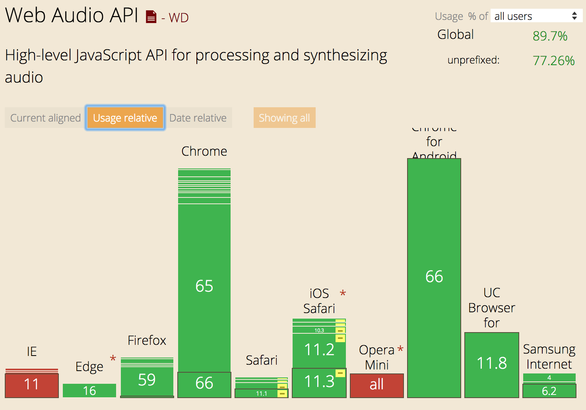
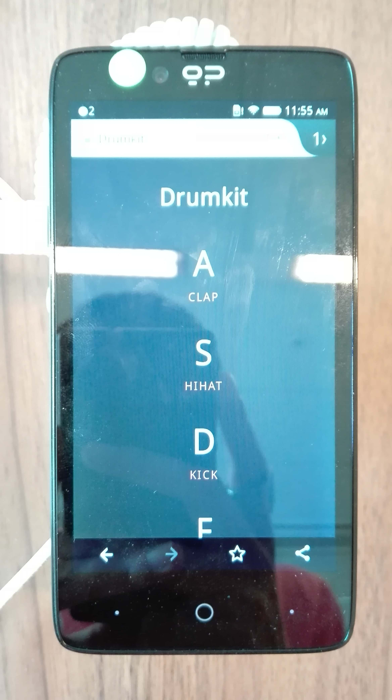

## Opdracht 3 - Progressive Enhanced Browser Technologies

:fire:[The App](https://afternoon-fjord-39549.herokuapp.com/):fire:  

Not enhanced  
  
Enhanced  


# Table of Content
- [Getting started](#getting-started)
- [Features](#features)
- [Core functionality](#core-functionality)
- [Enhancement](#enhancement)
- [Feature detection](#feature-dectection)
- [ES6 to ES5](#es6-to-es5)
- [Feature Support](#feature-support)
- [Browser testing](#browser-testing)
- [Device Lab](#device-lab)
- [Accessibility](#accessibility)
- [Colour and contrast](#colour-and-contrast)
- [Recources](#recources)

# Getting Started
How to get started with this project:

1. Clone the repo with `git clone https://github.com/Sam-Guliker/drumkit` or download it from github
2. Run `npm install` to install the dependencies
3. Run `npm start` to start the server
4. Go to [http://localhost:4000/](http://localhost:4000/)

# Features
The following is possible with this app
* Playing with a drumkit. With the keyboard or mouse-click
* Recording and playing back the sounds.
* Downloading the audio clip you've made and name it(Enhancement)

# Core functionality
The core functionality of my page will be to play on the drumkit.

# Enhancement
With the enhancement you can record, playback and download the audio file that you've created!:sunglasses:


# Feature detection
I've checked on the audio web api.  
`if` the browser/window does support the AudioContext and the navigator you can use the enhancment.

```Javascript
  if (AudioContext && navigator.mediaDevices.getuserMedia in window) {
    audioCheck()
  }
```

### ES6 to ES5
Es6 using const and arrowkeys
```Javascript
const keys = document.querySelectorAll('.key');
const audio =
document.querySelector(`audio[data-key="${e.keyCode}"]`);
const key = document.querySelector(`.key[data-key="${e.keyCode}"]`);

keys.forEach(key => key.addEventListener('transitionend',removeTransition));
keys.forEach(key => key.addEventListener('click', playSound))


```

Es5 instead of using arrow and for each functions I used for loops.  

```Javascript
var keys = document.querySelectorAll('.key');
var audio = document.querySelector("audio[data-key=" + "'" + keycode + "'" + "]");
var key = document.querySelector(".key[data-key=" + "'" + keycode + "'"+ "]");

for (var x = 0; x < keys.length; x++) {
  keys[x].addEventListener('transitionend', removeTransition)
}

for (var i = 0; i < keys.length; i++){
  keys[i].addEventListener('click', playSound)
}


```
# Feature support
`this` will be about what gets supported in different browsers. And why I've used  
some of the tags(this is self explornatary since I just want to have a good support :smileyface:

### Audio Element
The audio element is a strong element to use, it got great support.


### ES5
I've written all my code in ES5 so the browsers that can be supported will get the good ol' javascript :wink:.

#### Support


### DOM Manipulation.
To make sure I was using the most supported code for javascript I'm using code like `getElementsByTagName`.

#### Support


### Web Audio API
Web Audio API doesn't have such a great support, This is why I've used it as an enhancement. 

#### Support


### getUserMedia
getUserMedia got the same story as Web Audio API.

#### Support


# Browser Testing
### Chrome
Firefox also can handle the enhancement  

Firefox also can handle the enhancement  

Safari doesn't seem to like the api.


It breaks on IE8

but works on IE9


# Device Lab
Testing on different devices in device lab.  
The ones that weren't able to record sound: 





The one's I couldn't test: 
I think the latest tablets would be able to record, unfortunatly I'm not sure about this.


The one's that could use the enhancement:


# Accessibility
I've added tab indexes to the code so you can tab through the sounds.  
The other solution would be instead of KBD using buttons.

KBD: 
> The HTML Keyboard Input element (<kbd>) represents a span of inline text denoting textual user input from a keyboard, voice input, or any other text entry device. By convention, the user agent defaults to rendering the contents of a <kbd> element using its default monospace font, although this is not mandated by the HTML standard.
-[MDN](https://developer.mozilla.org/en-US/docs/Web/HTML/Element/kbd)
```pug
li(data-key="65" tabindex="1").key
        kbd A 
        audio(data-key='65' src='sounds/clap.wav' controls='controls')
        span.sound clap
```

# Colour and contrast
Chrome also has its own contrast checker.  
I first used `F16562` as an highlight colour, but I found out  
that it doesn't have enough contrast with my background.
I used `#FF726F` instead.


# Recources
* [Navigator](http://codeartists.com/post/36746402258/how-to-record-audio-in-chrome-with-native-html5)
* [Webaudio](https://developer.mozilla.org/en-US/docs/Web/API/Web_Audio_API)
* [Blob](http://qnimate.com/an-introduction-to-javascript-blobs-and-file-interface/)
* [Heroku](https://www.heroku.com/home)
* [Kbd](https://developer.mozilla.org/en-US/docs/Web/HTML/Element/kbd)


## Lisence
Copyright © 2018 Sam Guliker.  
Released under the [MIT license](https://opensource.org/licenses/MIT)
